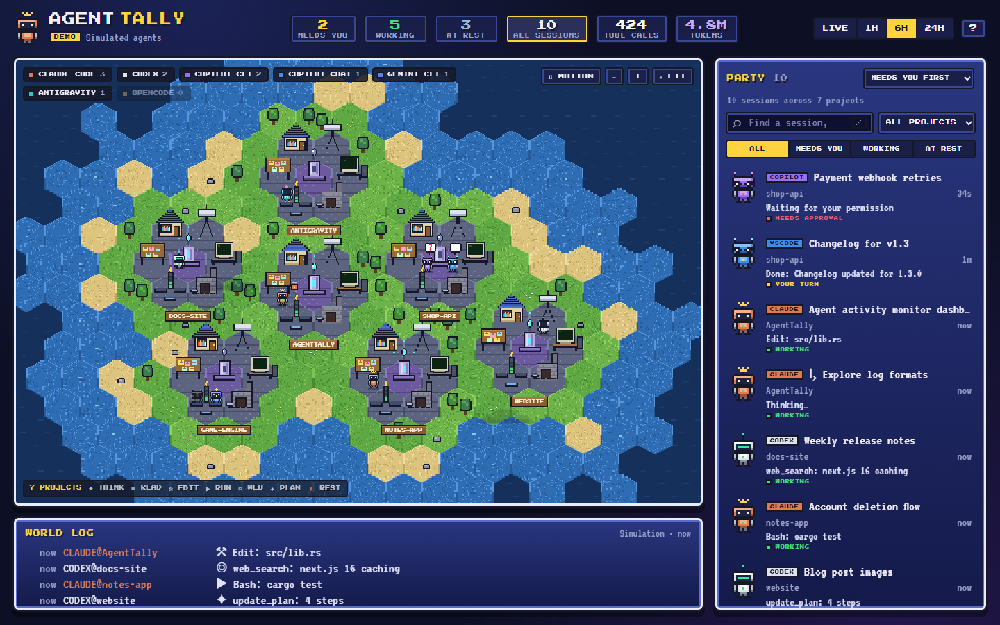
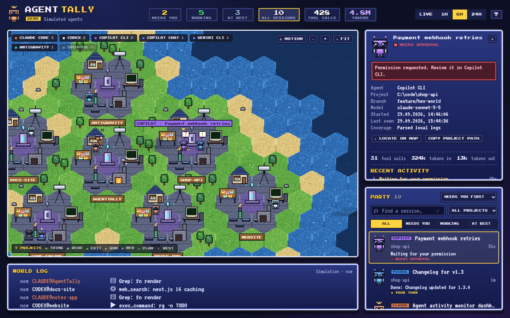
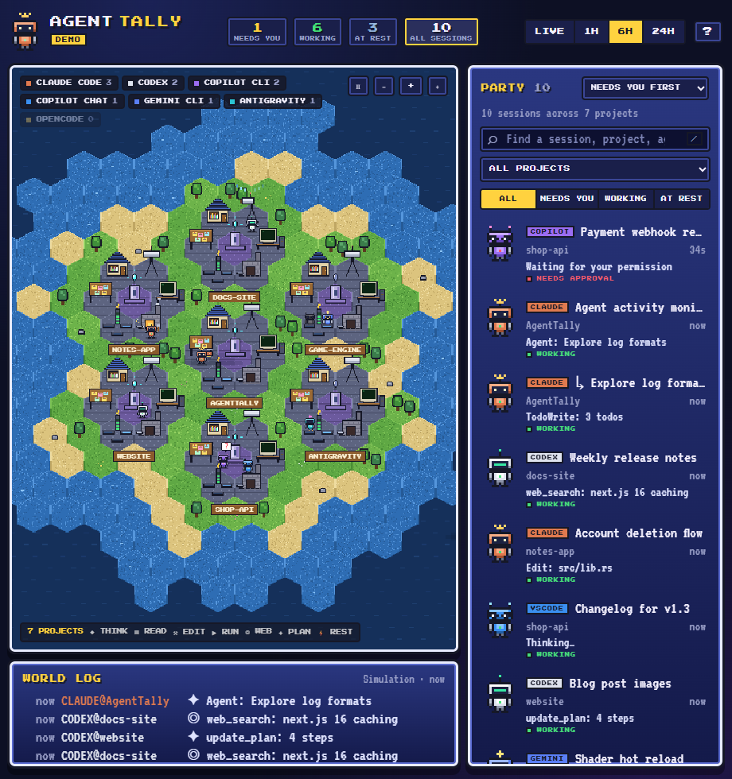

# AgentTally

A 16-bit hex world that shows what the AI coding agents on your machine are doing, live.

Every agent session is a small robot. Every project is a hex island with a **Core** in the
middle and six stations around it. Robots walk to the station that matches what their agent is
doing right now, so one glance tells you who is reading code, who is editing, who is running
commands, and who is waiting for **you**.



AgentTally only **reads** local log files. It never sends anything anywhere.

## Install

Download the latest version from the [Releases page](https://github.com/kasuken/AgentTally/releases/latest).

| Platform | File |
|---|---|
| Windows 10/11 | `AgentTally_<version>_x64-setup.exe` (or the `.msi`) |
| macOS, Apple Silicon | `AgentTally_<version>_aarch64.dmg` |
| macOS, Intel | `AgentTally_<version>_x64.dmg` |
| Linux | `AgentTally_<version>_amd64.AppImage`, `.deb` or `.rpm` |

The builds are not code-signed yet, so your OS will warn you the first time.

**Windows.** Run the `-setup.exe` installer. If SmartScreen says "Windows protected your PC",
choose **More info → Run anyway**. The app uses the WebView2 runtime, which ships with Windows 11
and is installed automatically on Windows 10 if missing.

**macOS.** Open the `.dmg` and drag **AgentTally** into **Applications**. Because the app is not
notarized, macOS may say it "is damaged" or "can't be opened". Remove the quarantine flag once:

```bash
xattr -dr com.apple.quarantine /Applications/AgentTally.app
```

**Linux.** Either make the AppImage executable and run it:

```bash
chmod +x AgentTally_*_amd64.AppImage && ./AgentTally_*_amd64.AppImage
```

or install the package for your distribution:

```bash
sudo apt install ./AgentTally_*_amd64.deb        # Debian, Ubuntu
sudo dnf install ./AgentTally-*.x86_64.rpm       # Fedora, RHEL
```

Then just start your agents as usual. Robots beam in as soon as a session writes to its log.

## How it works

| Station     | Activity                                   | Examples                                  |
|-------------|--------------------------------------------|-------------------------------------------|
| ◆ Core      | thinking, replying, waiting for you        | reasoning, final answer, permission asks  |
| ▤ Library   | reading and searching code                 | `Read`, `Grep`, `Glob`, `view`, readFile  |
| ⚒ Forge     | editing files                              | `Edit`, `Write`, `apply_patch`, replace   |
| ▶ Terminal  | running commands                           | `Bash`, `exec_command`, `powershell`      |
| ◎ Radar     | web and MCP tools                          | `WebFetch`, `web_search`, `mcp__*`        |
| ✦ Quests    | planning and sub-agents                    | `TodoWrite`, `Agent`/`Task`, `update_plan`|
| ⚡ Dock      | idle, sleeping or closed sessions          |                                           |

Robot bubbles: `…` thinking · yellow `!` finished its turn, **your turn** · red `?` waiting for
permission · `Zzz` sleeping. The chest light shows the status colour. Sub-agents are small drones
that orbit their parent robot.

Select a robot or a party card to follow it: the camera flies to it and the details window
shows its project, branch, model, token usage and recent activity.



### Supported agents

| Agent | Where it reads | Detail |
|---|---|---|
| Claude Code (CLI, desktop, IDE) | `~/.claude/projects/*/*.jsonl` (+ `subagents/`) | full: prompts, tools, tokens, titles |
| Codex (CLI / desktop) | `~/.codex/sessions/YYYY/MM/DD/rollout-*.jsonl` | full: tools (incl. code-mode `exec`), tokens, sub-agents |
| GitHub Copilot CLI | `~/.copilot/session-state/*/events.jsonl` | full: tools, permission prompts, session names |
| GitHub Copilot Chat (VS Code, Insiders, Cursor, VSCodium) | `<config>/Code*/User/workspaceStorage/*/chatSessions/*.jsonl` | prompts, tool invocations, titles |
| Gemini CLI | `~/.gemini/tmp/*/chats/session-*.json` | prompts, tools, tokens |
| Antigravity | `~/.gemini/antigravity*/conversations/*` | presence only (binary format) |
| OpenCode | `~/.local/share/opencode/opencode.db*` | presence only |

`<config>` is `%APPDATA%` on Windows, `~/Library/Application Support` on macOS and `~/.config`
on Linux. `CLAUDE_CONFIG_DIR` and `CODEX_HOME` are respected. Sessions touched in the last
24 hours are tracked; the UI filters to LIVE / 1H / 6H / 24H.

### How status is derived

- **Working**: a turn is open and something was logged in the last 2 minutes (20 minutes if a
  tool call is still running).
- **Your turn**: the agent ended its turn (e.g. Claude `end_turn`, Codex `task_complete`,
  Copilot final `assistant.turn_end`) less than 20 minutes ago.
- **Needs approval**: a permission or approval request is pending (Copilot CLI, Codex).
- **Idle / Sleeping**: quiet for 20 minutes / 3 hours. **Offline**: the session was shut down.

## Controls

The screen is a 16-bit HUD: counters and the time window on top, the hex world as the main
window (sources, map controls and the station key float over it), the world log below and the
party list on the right. **Needs you** comes first: permission requests, then completed turns.
Click a HUD counter or a party status tab to filter. Counters always cover the selected time
window and enabled providers; search, project, and status filters (in the party window) narrow
the world, party list, and world log together.

- Search by session title, project, path, provider, client, or model. `/` focuses search.
- Filter by project or provider. **Clear filters** restores all sources and the 6-hour window.
- Sessions default to **Needs you first**, with stable ordering within each status so they
  do not jump around on every log update. Choose **Recently active** or **By project** as needed.
- Select a robot, session, or activity entry to inspect details and wrapped event text.
  Copy the project path or locate the robot from the details panel. Approvals and replies
  still happen in the original agent application.
- Drag to pan, scroll to zoom around the pointer, or use the zoom buttons. `F` fits the world.
- **Motion** pauses animation while snapshots keep updating. Reduced-motion preferences
  are respected. Rendering is capped at 30 fps and stops while the page is hidden.
- `Esc` closes session details; `?` opens the guide. Controls are keyboard accessible.
- Time window, enabled sources, sorting, and motion preferences are saved locally.

The source badge explicitly distinguishes **DEMO**, **LIVE**, and **RECONNECTING**.
Interrupted updates preserve the last snapshot, show a warning, and retry automatically.

The layout adapts to smaller windows, down to a narrow side-by-side view and a phone-sized
single column:



## Build from source

Requirements: [Rust](https://rustup.rs) (stable), Node 18+, and the
[Tauri prerequisites](https://tauri.app/start/prerequisites/) for your OS (WebView2 on Windows,
Xcode command line tools on macOS, `webkit2gtk-4.1` and friends on Linux).

```bash
git clone https://github.com/kasuken/AgentTally.git
cd AgentTally
npm install
npm run dev        # desktop app in development mode
npm run build      # release build + installers in src-tauri/target/release/bundle
```

UI-only preview in a browser, without Tauri:

```bash
npm run preview    # http://localhost:5178/?demo  simulated agents
                   # http://localhost:5178/?live  real logs via the debug binary (cargo build first)
```

Debug the log parsers without the UI:

```bash
cd src-tauri && cargo run -- --dump    # prints one snapshot as JSON
```

### Tests

```bash
npm test           # filters, attention ordering, map fit, zoom, and paused motion
cargo test --manifest-path src-tauri/Cargo.toml
```

For browser recovery checks without reading real agent logs, run
`node tests/fixture-server.mjs <absolute-mode-file>` and open
`http://localhost:5179/?live` (set `PORT` to use another port). Put `ready`, `error`, or
`empty` in the mode file to exercise the corresponding snapshot state. This test fixture uses
simulated sessions.

### Releasing

Pushing a version tag builds installers for Windows, Linux, and macOS (Apple Silicon and Intel)
with GitHub Actions and publishes them as a GitHub release:

```bash
git tag v0.1.0 && git push origin v0.1.0
```

Bump `version` in `src-tauri/tauri.conf.json`, `src-tauri/Cargo.toml` and `package.json` first.

## Project layout

```
src-tauri/src/
  lib.rs            Tauri setup, background scan loop, `snapshot` command, "tally" event
  scanner.rs        finds session files, tails them incrementally (2 MB replay on first sight;
                    project root, first prompt and parent are read from the head)
  model.rs          Session / Activity / Status, tool → station mapping
  providers/        one parser per agent log format
ui/
  index.html, style.css
  js/world.js       hex map, layout, robots, camera, rendering
  js/sprites.js     pixel art: robots, tiles, buildings, bubbles
  js/main.js        data source, HUD, roster, logs
  js/selectors.js   time, project, provider, search, status, and sorting rules
  js/demo.js        simulated data for ?demo
.github/workflows/  CI tests and the cross-platform release build
```

## Credits

Inspired by pixel-agent visualizers such as
[pixel-agents-standalone](https://github.com/rolandal/pixel-agents-standalone),
[agent-move](https://github.com/ylascaux/agent-move),
[agentroom](https://github.com/liuyixin-louis/agentroom) and
[agent-factory](https://github.com/kalmigs/agent-factory).

Fonts: Press Start 2P and VT323 (SIL Open Font License), bundled in `ui/fonts`.
