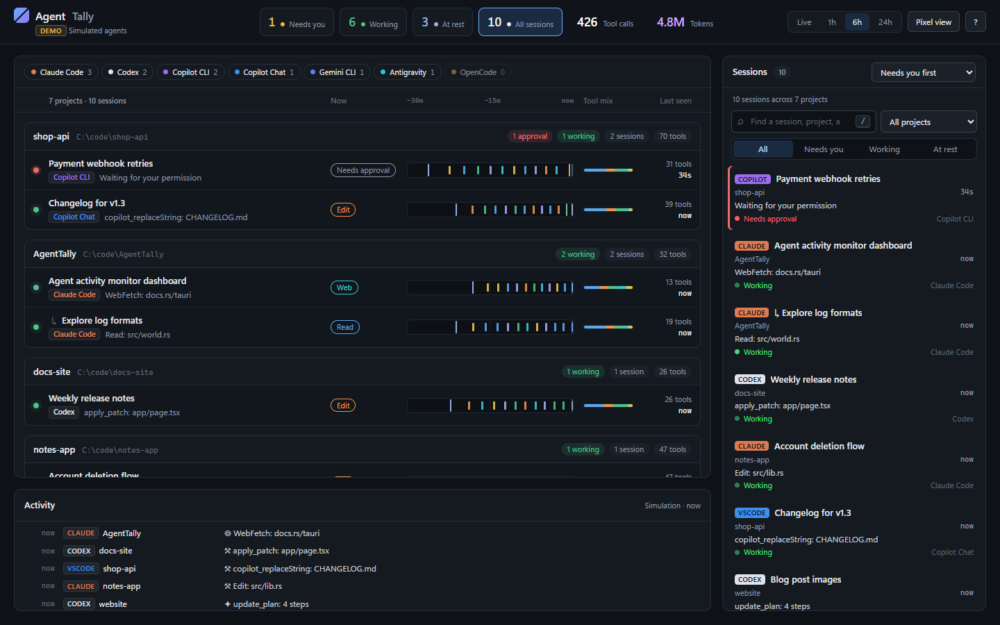
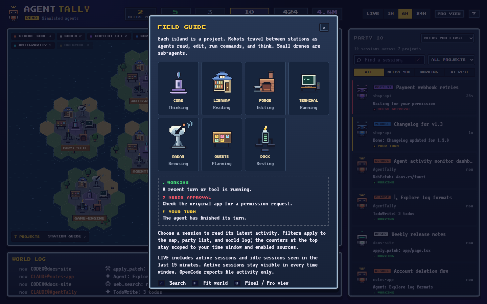
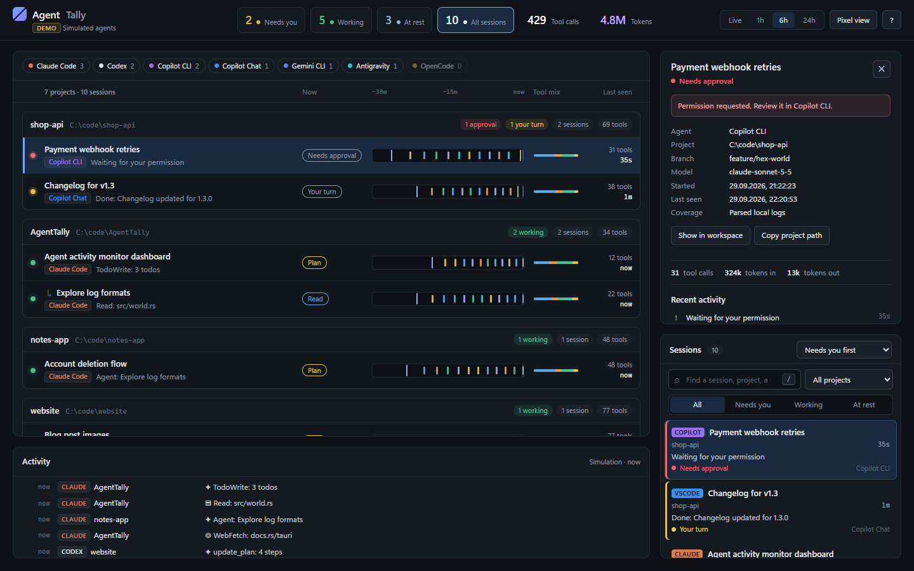

# AgentTally

[](https://github.com/kasuken/AgentTally/releases/latest)
[](https://github.com/kasuken/AgentTally/actions/workflows/ci.yml)


See what the AI coding agents on your machine are doing, live: Claude Code, Codex, GitHub
Copilot, Gemini CLI, Antigravity and more, side by side.

AgentTally has two interfaces over the same data, and you can switch between them at any time:

- **Pixel** (default): a 16-bit hex world. Every project is an island, every agent session is a
  small robot that walks to the building matching what it is doing right now.
- **Pro**: a calm workspace dashboard with one panel per project, one row per session and a
  30-minute activity timeline.




AgentTally only **reads** local log files. It never sends anything anywhere.

## Install

Download the latest version from the [Releases page](https://github.com/kasuken/AgentTally/releases/latest).

| Platform | File |
|---|---|
| Windows 10/11 | `AgentTally_<version>_x64-setup.exe` (or the `.msi`) |
| macOS, Apple Silicon | `AgentTally_<version>_aarch64.dmg` |
| macOS, Intel | `AgentTally_<version>_x64.dmg` |
| Linux | `AgentTally_<version>_amd64.AppImage`, `.deb` or `.rpm` |

The builds are not code-signed yet, so your OS will warn you the first time.

**Windows.** Run the `-setup.exe` installer. If SmartScreen says "Windows protected your PC",
choose **More info → Run anyway**. The app uses the WebView2 runtime, which ships with Windows 11
and is installed automatically on Windows 10 if missing.

**macOS.** Open the `.dmg` and drag **AgentTally** into **Applications**. Because the app is not
notarized, macOS may say it "is damaged" or "can't be opened". Remove the quarantine flag once:

```bash
xattr -dr com.apple.quarantine /Applications/AgentTally.app
```

**Linux.** Either make the AppImage executable and run it:

```bash
chmod +x AgentTally_*_amd64.AppImage && ./AgentTally_*_amd64.AppImage
```

or install the package for your distribution:

```bash
sudo apt install ./AgentTally_*_amd64.deb        # Debian, Ubuntu
sudo dnf install ./AgentTally-*.x86_64.rpm       # Fedora, RHEL
```

Then just start your agents as usual. Sessions appear as soon as they write to their logs.

## The Pixel world

Every project is a hex island with a **Core** in the middle and six buildings around it. Robots
walk to the building that matches what their agent is doing, so one glance tells you who is
reading code, who is editing, who is running commands, and who is waiting for **you**.

| Station     | Activity                                   | Examples                                  |
|-------------|--------------------------------------------|-------------------------------------------|
| ◆ Core      | thinking, replying, waiting for you        | reasoning, final answer, permission asks  |
| ▤ Library   | reading and searching code                 | `Read`, `Grep`, `Glob`, `view`, readFile  |
| ⚒ Forge     | editing files                              | `Edit`, `Write`, `apply_patch`, replace   |
| ▶ Terminal  | running commands                           | `Bash`, `exec_command`, `powershell`      |
| ◎ Radar     | web and MCP tools                          | `WebFetch`, `web_search`, `mcp__*`        |
| ✦ Quests    | planning and sub-agents                    | `TodoWrite`, `Agent`/`Task`, `update_plan`|
| ⚡ Dock      | idle, sleeping or closed sessions          |                                           |

Robot bubbles: `…` thinking · yellow `!` finished its turn, **your turn** · red `?` waiting for
permission · `Zzz` sleeping. The chest light shows the status colour. Sub-agents are small drones
that orbit their parent robot. **Station guide** (bottom left of the map, or <kbd>?</kbd>) shows
every building and what it means.



Each robot also has a colour and head for its agent: orange with a star antenna for Claude,
white with a visor for Codex, purple or blue with goggles for Copilot, blue with a sparkle for
Gemini, and a hovering cyan robot for Antigravity.

## The Pro workspace

Press **Pro view** in the top bar (or <kbd>U</kbd>) for a professional dashboard with the same
data and the same controls:

- One panel per project, showing its path and counts (approvals, your turn, working, sessions,
  tool calls). Projects that need you come first.
- One row per session: status, title, agent, current activity, and a chip for what it is doing
  now (Think, Read, Edit, Run, Web, Plan, or its status when it is not working).
- A **30-minute activity timeline** per session: each tick is one event, coloured by what the
  agent was doing (the guide has the full legend). Next to it: the tool mix, tool count and when
  the session was last seen.
- Sub-agents are indented under their parent session.

AgentTally remembers your choice of interface. The Pixel world is the default.

## Desktop buddy

Minimize AgentTally and its own robot, pink with a crown, stays on your desktop, above the
taskbar and on top of other windows, without a window around it. Its thought cloud reports on
all your agents at once: how many need your OK, have finished their turn, are working or idle,
then one line per busy agent with its project and what it is doing right now (agents that need
you first; a line flashes when its agent moves on).

The robot acts out the overall picture: it waves and hops when anyone needs you, plays the tool
animation of the agent that did something last while any are working, reads or relaxes on the
beach when they are all idle, and shows `Zzz` when they are all asleep.

- Drag the robot to move it. Click the cloud or double-click the robot to bring the main window
  back.
- Clicks on the empty space around the robot go through to the windows underneath.

## Session details

Select a robot, a workspace row, a session card or an activity entry to open its details: project
path, branch, model, start time, token usage, tool calls and the recent activity with timestamps.
In the Pixel world the camera flies to the robot; in Pro view the row is highlighted. Approvals
and replies still happen in the original agent application; AgentTally tells you where to look.

| Pixel | Pro |
|---|---|
|  |  |

## Supported agents

| Agent | Where it reads | Detail |
|---|---|---|
| Claude Code (CLI, desktop, IDE) | `~/.claude/projects/*/*.jsonl` (+ `subagents/`) | full: prompts, tools, tokens, titles, sub-agents |
| Codex (CLI / desktop) | `~/.codex/sessions/YYYY/MM/DD/rollout-*.jsonl` | full: tools (incl. code-mode `exec`), tokens, sub-agents |
| GitHub Copilot CLI | `~/.copilot/session-state/*/events.jsonl` | full: tools, permission prompts, session names |
| GitHub Copilot Chat (VS Code, Insiders, Cursor, VSCodium) | `<config>/Code*/User/workspaceStorage/*/chatSessions/*.jsonl` | prompts, tool invocations, titles |
| Gemini CLI | `~/.gemini/tmp/*/chats/session-*.json` | prompts, tools, tokens |
| Antigravity (IDE and CLI) | `~/.gemini/antigravity*/conversation_summaries.db`, `conversations/`, `history.jsonl` | title, project, run status, sub-agents, prompts (CLI) |
| OpenCode | `~/.local/share/opencode/opencode.db*` | activity only |

`<config>` is `%APPDATA%` on Windows, `~/Library/Application Support` on macOS and `~/.config`
on Linux. `CLAUDE_CONFIG_DIR` and `CODEX_HOME` are respected. Sessions touched in the last
24 hours are tracked; the UI filters to LIVE / 1H / 6H / 24H. When several agents work in the
same folder, they share one project.

### How status is derived

- **Working**: a turn is open and something was logged in the last 2 minutes (20 minutes if a
  tool call is still running). For Antigravity: its run status is "running".
- **Your turn**: the agent ended its turn (e.g. Claude `end_turn`, Codex `task_complete`,
  Copilot's final `assistant.turn_end`, Antigravity "idle") less than 20 minutes ago.
- **Needs approval**: a permission or approval request is pending (Copilot CLI, Codex).
- **Idle / Sleeping**: quiet for 20 minutes / 3 hours. **Offline**: the session was shut down
  or stopped.

## Controls

The top bar has the counters, the time window, the interface switch and the guide. The main
window is the Pixel world or the Pro workspace, with the activity log below it and the session
list on the right. **Needs you** comes first: permission requests, then completed turns.
Click a counter or a status tab to filter. Counters always cover the selected time window and
enabled sources; search, project, and status filters (in the session list) narrow the main
window, the session list, and the activity log together.

- Search by session title, project, path, provider, client, or model. <kbd>/</kbd> focuses search.
- Filter by project or source (click a source chip to hide or show it). **Clear filters**
  restores all sources and the 6-hour window.
- Sessions default to **Needs you first**, with stable ordering within each status so they
  do not jump around on every log update. Choose **Recently active** or **By project** as needed.
- Details: copy the project path, or **Locate on map** / **Show in workspace**.
- Pixel world: drag to pan, scroll to zoom around the pointer, or use the zoom buttons.
  <kbd>F</kbd> fits the world. **Motion** pauses animation while data keeps updating.
- Pro view: <kbd>F</kbd> scrolls the workspace back to the top.
- <kbd>U</kbd> switches between Pixel and Pro, <kbd>Esc</kbd> closes details, <kbd>?</kbd> opens
  the guide. Everything is keyboard accessible, and reduced-motion preferences are respected.
- Time window, enabled sources, sorting, interface, and motion preferences are saved locally.

The source badge distinguishes **DEMO**, **LIVE**, and **RECONNECTING**. Interrupted updates keep
the last snapshot, show a warning, and retry automatically.

Both interfaces adapt to smaller windows, down to a narrow side-by-side view and a phone-sized
single column:


## Build from source

Requirements: [Rust](https://rustup.rs) (stable), Node 18+, and the
[Tauri prerequisites](https://tauri.app/start/prerequisites/) for your OS (WebView2 on Windows,
Xcode command line tools on macOS, `webkit2gtk-4.1` and friends on Linux).

```bash
git clone https://github.com/kasuken/AgentTally.git
cd AgentTally
npm install
npm run dev        # desktop app in development mode
npm run build      # release build + installers in src-tauri/target/release/bundle
```

UI-only preview in a browser, without Tauri:

```bash
npm run preview    # http://localhost:5178/?demo  simulated agents
                   # http://localhost:5178/?live  real logs via the debug binary (cargo build first)
```

Debug the log parsers without the UI:

```bash
cd src-tauri && cargo run -- --dump    # prints one snapshot as JSON
```

### Tests

```bash
npm test           # filters, ordering, map fit and zoom, workspace grouping and timelines
cargo test --manifest-path src-tauri/Cargo.toml    # log parsers, status rules, scanner
```

For browser recovery checks without reading real agent logs, run
`node tests/fixture-server.mjs <absolute-mode-file>` and open
`http://localhost:5179/?live` (set `PORT` to use another port). Put `ready`, `error`, or
`empty` in the mode file to exercise the corresponding snapshot state. This test fixture uses
simulated sessions.

### Releasing

1. Bump `version` in `package.json`, `src-tauri/Cargo.toml` and `src-tauri/tauri.conf.json`
   (then run `npm install` and `cargo check` to update the lock files).
2. Write the release notes in `.github/release-notes.md`.
3. Push a version tag. GitHub Actions builds installers for Windows, Linux and macOS (Apple
   Silicon and Intel) and publishes the release:

```bash
git tag -a vX.Y.Z -m "AgentTally vX.Y.Z" && git push origin vX.Y.Z
```

## Project layout

```
src-tauri/src/
  lib.rs            Tauri setup, background scan loop, `snapshot` command, "tally" event
  buddy.rs          desktop buddy window: shown while the main window is minimized
  scanner.rs        finds session files, tails them incrementally (2 MB replay on first sight;
                    project root, first prompt and parent are read from the head)
  model.rs          Session / Activity / Status, tool → station mapping
  providers/        one parser per agent log format (Antigravity reads its SQLite summaries
                    read-only via rusqlite)
ui/
  index.html        one page for both interfaces
  buddy.html        desktop buddy (with buddy.css and js/buddy.js)
  style.css         Pixel interface (default)
  pro.css           Pro interface, loaded instead of style.css
  js/main.js        data source, counters, session list, details, activity log, interface switch
  js/world.js       hex map, layout, robots, camera, rendering (Pixel)
  js/board.js       project panels, session rows and activity timelines (Pro)
  js/sprites.js     pixel art: robots, tiles, buildings, bubbles
  js/selectors.js   time, project, provider, search, status, and sorting rules
  js/demo.js        simulated data for ?demo
docs/screenshots/   README images, taken from demo mode
.github/workflows/  CI tests and the cross-platform release build
```

## Credits

Inspired by pixel-agent visualizers such as
[pixel-agents-standalone](https://github.com/rolandal/pixel-agents-standalone),
[agent-move](https://github.com/ylascaux/agent-move),
[agentroom](https://github.com/liuyixin-louis/agentroom) and
[agent-factory](https://github.com/kalmigs/agent-factory).

Fonts: Press Start 2P and VT323 (SIL Open Font License), bundled in `ui/fonts`.
